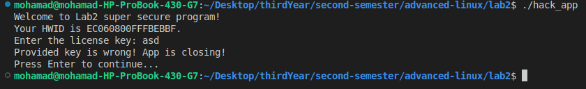

# Lab 2: GDB

## Task Overview

In this lab, we explored various debugging and reverse engineering tools, including GDB, strace, GHIDRA, and ldd. The main objectives were to:

- Analyze a given application that requires a hardware-based license.
- Implement two artifacts:
  1. A keygen to generate valid licenses.
  2. A binary patch to disable licensing checks completely.

---

## Step 1: Running the Application

We start by executing the provided hack application.



---

## Step 2: Installing Required Libraries

The application depends on `libcrypto.so.1.1`, which must be installed manually. This is done using the following command:

```sh
wget http://archive.ubuntu.com/ubuntu/pool/main/o/openssl/libssl1.1_1.1.0g-2ubuntu4_amd64.deb
```

After installation, we verify that all required libraries are correctly installed using `ldd`:

```sh
ldd hack_app
```

Output confirms all dependencies are resolved:


---

## Step 3: Reverse Engineering with GHIDRA

After installing GHIDRA, we create a project and import `hack_app` for analysis.


### Keygen Implementation

We create a Python script to generate valid licenses based on the hardware ID:

```python
import hashlib

def hash_hardware_id(hardware_id):
    hashed_id = hashlib.md5(hardware_id.encode()).digest()[::-1].hex()
    print("Your hashed id is: ", hashed_id)
    return hashed_id

if __name__ == "__main__":
    hardware_id = input("Enter your HWID: ")
    if len(hardware_id) < 16:
        print("Invalid HWID. Please enter a valid HWID.")
    else:
        print("Your HWID is valid.")
        hash_hardware_id(hardware_id)
```

### Modifying the Binary

Using GHIDRA, we locate the variable `iVAr1` and modify its value to zero. This change ensures that `local_34[4]` is set to `1`, triggering the following message:

```sh
puts("Your app is licensed to this PC!");
```

#### Before modification


#### After modification


We update the instruction at `0x21` to `0x0` using a patch:


After making these changes, we export the patched binary:


Finally, we make the modified application executable and run it:

```sh
chmod +x hack_app
./hack_app
```


---

## Step 4: Testing the Keygen

We now test our keygen script with the original application:


---

## Step 5: Creating a Binary Patch

To automate patching the original binary, we compare the original and patched files using `diffnow.com`:


Using this difference, we write a Python script to modify the binary dynamically:

```python
import sys

# Define original and replacement byte sequences
old_bytes = b'\xBA\x21\x00'
new_bytes = b'\xBA\x00\x00'

def patch_binary(filename):
    with open(filename, "rb") as f:
        data = f.read()

    # Find first occurrence
    index = data.find(old_bytes)
    if index == -1:
        print("Pattern BA 21 00 not found!")
        return

    # Replace only the first occurrence
    patched_data = data[:index] + new_bytes + data[index + len(old_bytes):]

    # Save the modified file
    patched_filename = "patched_" + filename
    with open(patched_filename, "wb") as f:
        f.write(patched_data)

    print(f"Patching complete: {patched_filename}")

# Usage: python script.py hack_app
if __name__ == "__main__":
    if len(sys.argv) < 2:
        print("Usage: python patch.py <filename>")
        sys.exit(1)

    patch_binary(sys.argv[1])
```

running the script :


[Github Lab02 link](https://github.com/Mohammed-Nour/advanced-linux/tree/main/Lab02/)
