# **Lab 3: Booting the Kernel**

A complete, step‑by‑step walkthrough with embedded evidence and explanations

---

## Part I: Building U‑Boot & the Linux Kernel

### 1. Install prerequisites

```bash
sudo apt update
sudo apt install -y qemu qemu-system-arm gcc-arm-linux-gnueabihf
```

### 2. Clone and compile U‑Boot

```bash
git clone https://github.com/u-boot/u-boot.git
cd u-boot
git checkout v2022.01

export ARCH=arm
export CROSS_COMPILE=arm-linux-gnueabihf-
make vexpress_ca9x4_defconfig
make -j8
```

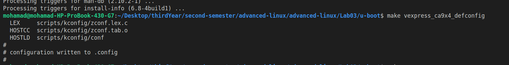  
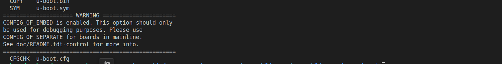

### 3. Smoke‑test U‑Boot under QEMU

```bash
qemu-system-arm -M vexpress-a9 -kernel u-boot -m 512M
qemu-system-arm -M vexpress-a9 -kernel u-boot -m 512M -nographic
```

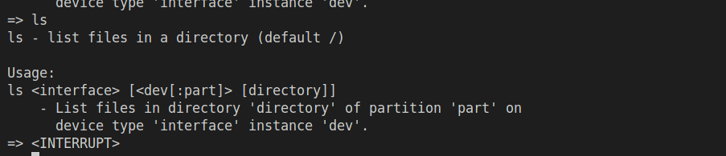

### 4. Download & compile mainline Linux 6.15

```bash
cd ..
wget https://www.kernel.org/pub/linux/kernel/v6.x/linux-6.15.tar.gz
tar -xvf linux-6.15.tar.gz
cd linux-6.15

export ARCH=arm
export CROSS_COMPILE=arm-linux-gnueabihf-
make vexpress_defconfig
make zImage -j8
make modules -j8
make dtbs -j8
```

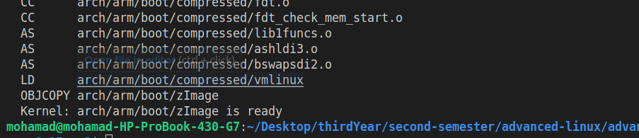  
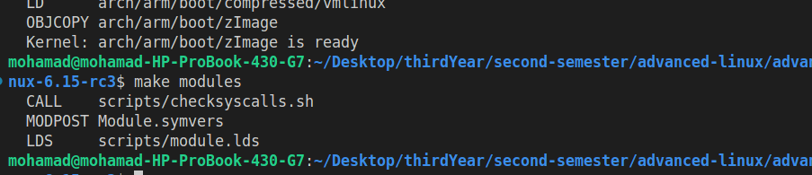  
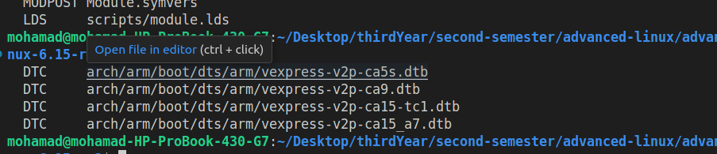

### 5. Verify the raw zImage boots

```bash
qemu-system-arm -M vexpress-a9 -m 512M \
  -kernel arch/arm/boot/zImage \
  -append "console=ttyAMA0" \
  -dtb arch/arm/boot/dts/arm/vexpress-v2p-ca9.dtb \
  -nographic
```

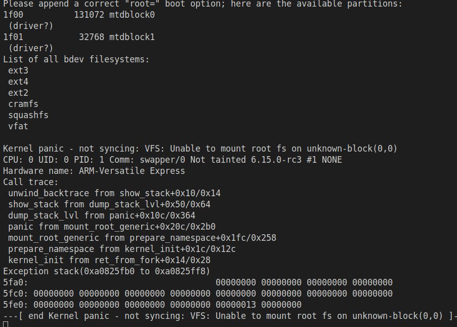

---

## Part II: Building & Packaging an Initramfs

### 6. Compile BusyBox

```bash
cd ..
wget https://busybox.net/downloads/busybox-1.36.0.tar.bz2
tar -xvf busybox-1.36.0.tar.bz2
cd busybox-1.36.0

export ARCH=arm
export CROSS_COMPILE=arm-linux-gnueabihf-
make defconfig
make menuconfig   # enable static, mdev/getty if desired
make -j8
make install
```

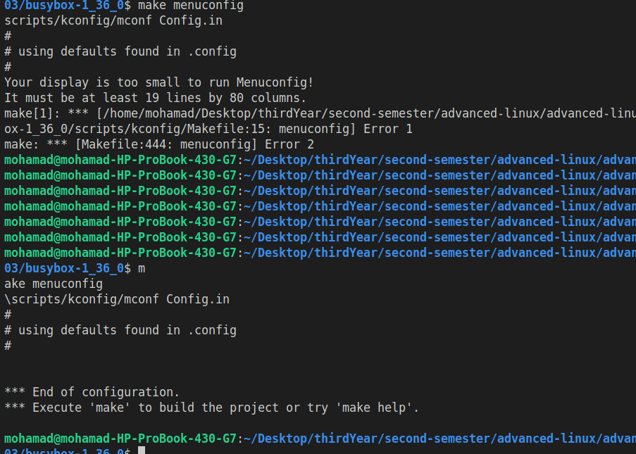

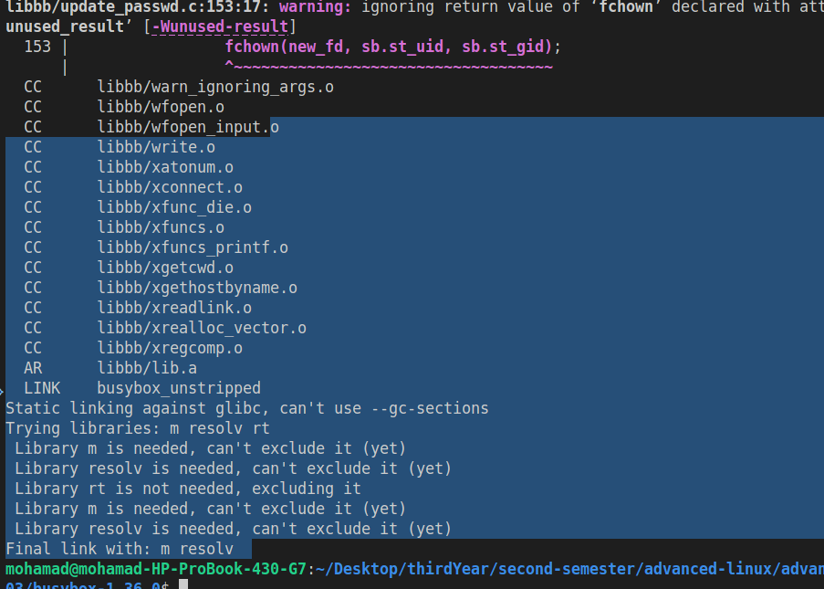

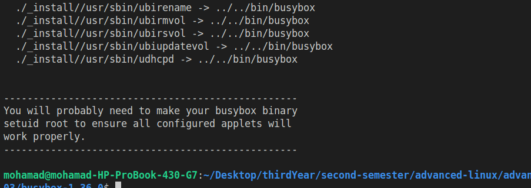

### 7. Assemble the initramfs layout

```bash
cd ..
mkdir -p initramfs/{bin,sbin,etc,proc,sys,dev,usr/{bin,sbin}}
cp -a busybox-1.36.0/_install/* initramfs/
```

### 8. Add a first‑stage `init` script

```bash
cd initramfs
cat > init << 'EOF'
#!/bin/sh
mount -t proc none /proc
mount -t sysfs none  /sys
mount -t devtmpfs none /dev

mkdir /newroot
# Mount the whole SD (no partitions) or change to mmcblk0p2 if partitioned
mount -t ext4 /dev/mmcblk0 /newroot

exec switch_root /newroot /sbin/init
EOF
chmod +x init
```

### 9. Package into a gzipped cpio

```bash
find . -print0 | cpio --null -ov --format=newc | gzip -9 > ../initramfs.cpio.gz
cd ..
```

---

## Part III: Creating the Rootfs & SD Image

### 10. Prepare a minimal BusyBox rootfs

```bash
mkdir -p rootfs/{bin,sbin,etc,proc,sys,usr/{bin,sbin},dev,tmp,home}
cp -a busybox-1.36.0/_install/* rootfs/
sudo mknod -m 666 rootfs/dev/console c 5 1
sudo mknod -m 666 rootfs/dev/null   c 1 3
```

### 11. Make the raw ext4 image (no partition table)

```bash
dd if=/dev/zero of=rootfs.ext4 bs=1M count=64
mkfs.ext4 -F -L ROOT rootfs.ext4
```

### 12. Build a 2‑partition SD image via **fdisk**

```bash
dd if=/dev/zero of=sd.img bs=1M count=64
fdisk sd.img
```

*In `fdisk sd.img`, type:*

```bash
o    # new DOS label
n p 1 <Enter> +16M   # partition 1: 16 MiB
n p 2 <Enter> <Enter>  # partition 2: remainder
t 1 c   # set p1 type to W95 FAT32 (LBA)
w    # write & quit
```

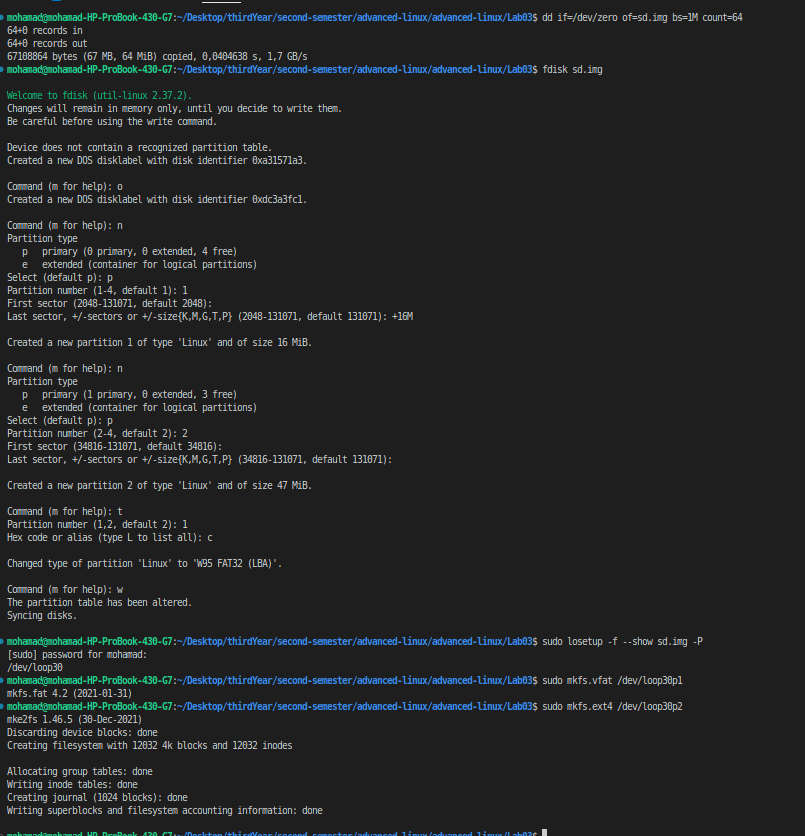

### 13. Map & format partitions

```bash
LOOP=$(sudo losetup --find --show --partscan sd.img)
sudo mkfs.vfat  -n BOOT "${LOOP}p1"
sudo mkfs.ext4  -L ROOT "${LOOP}p2"
```

### 14. Populate the boot partition

```bash
mkimage -A arm -T ramdisk -C gzip -n "Initramfs" \
  -d initramfs.cpio.gz uInitrd

sudo mount "${LOOP}p1" mnt
sudo cp linux-6.15/arch/arm/boot/zImage    mnt/
sudo cp linux-6.15/arch/arm/boot/dts/arm/vexpress-v2p-ca9.dtb mnt/vexpress.dtb
sudo cp uInitrd                             mnt/
sudo umount mnt
```

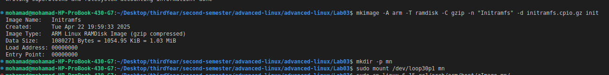  
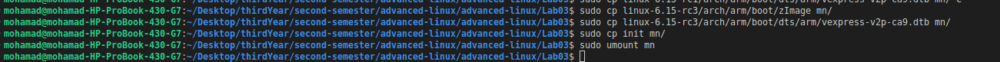

### 15. Populate the rootfs partition

```bash
sudo mount "${LOOP}p2" mnt
sudo cp -a rootfs/* mnt/
sudo umount mnt
sudo losetup -d "$LOOP"
```

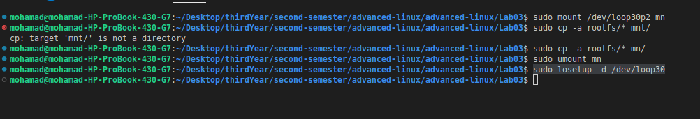

---

## Part IV: Booting Everything in QEMU + U‑Boot

1. **Launch U‑Boot** with your SD image:

   ```bash
   qemu-system-arm -M vexpress-a9 \
     -m 512M \
     -kernel u-boot/u-boot \
     -drive file=sd.img,format=raw,if=sd \
     -nographic
   ```

2. **At the U‑Boot prompt**, load and start:

   ```bash
   fatload mmc 0:1 0x60000000 zImage
   fatload mmc 0:1 0x61000000 uInitrd
   fatload mmc 0:1 0x62000000 vexpress.dtb
   setenv bootargs "console=ttyAMA0 loglevel=3 init=/init"
   bootz 0x60000000 0x61000000 0x62000000
   ```

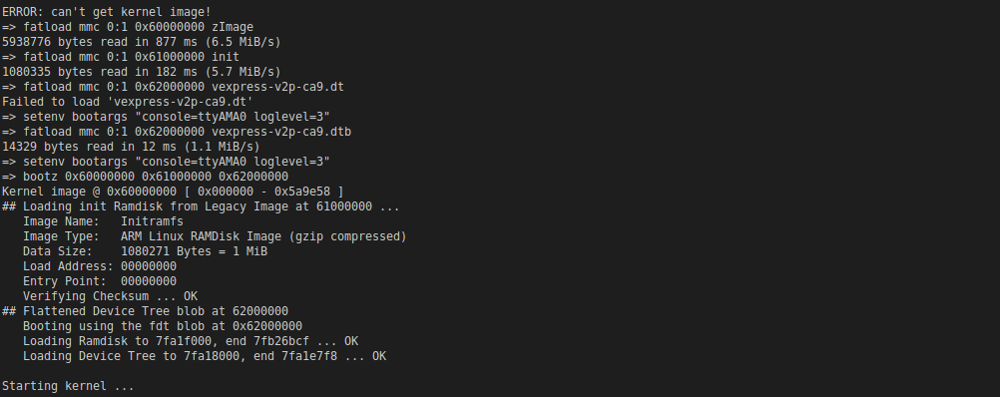

 **Watch the kernel and initramfs**:

   ```bash
   Starting kernel ...
   Unpacking initramfs...
   Run /init as init process
   Boot took 1.60 seconds
   switch_root: moving to new root /newroot
   sh-5.1#
   ```

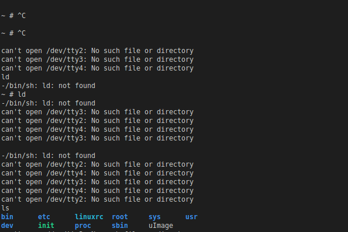

**Verify your final rootfs**:

   ```sh
   sh-5.1# mkdir /home/test
   sh-5.1# ls /home
   test
   ```


---

## Explanation & Checklist

- **Partition mounting**  
  We chose to keep the raw image unpartitioned for the initramfs (`/dev/mmcblk0`), but here we created two partitions. In our `/init`, we mount **partition 2** (`/dev/mmcblk0p2`).  

- **`init=/init`**  
  Adding `init=/init` in `bootargs` ensures the kernel runs our first‑stage script from the initramfs.  

- **Dynamic device nodes**  
  We rely on `devtmpfs` for `/dev/console` and `/dev/null` in the initramfs. In your rootfs you created the minimal nodes with `mknod`.  

- **Serial‑only console**  
  We boot with `-nographic` and `console=ttyAMA0`; no extra ttys are spawned. If you see `/dev/tty2` errors, remove those getty lines in `/etc/inittab`.  

With this complete chain—**U‑Boot → Kernel+Initramfs → switch_root → ext4 Rootfs**—we have demonstrated the full embedded Linux boot flow.
