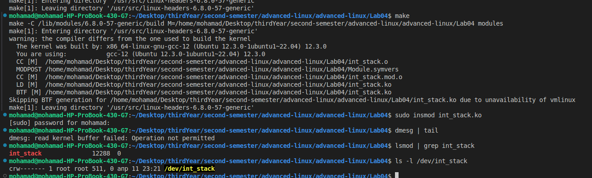
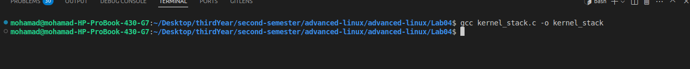
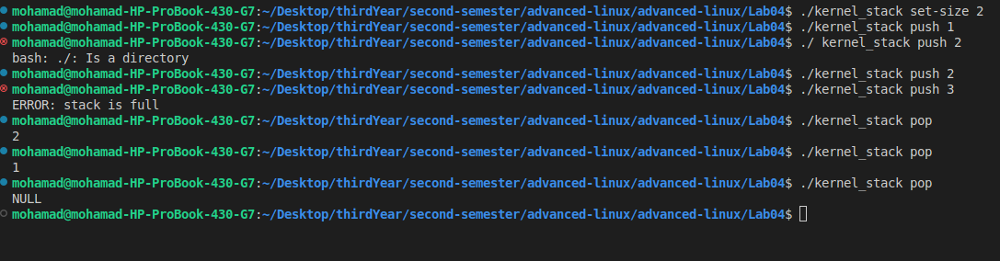
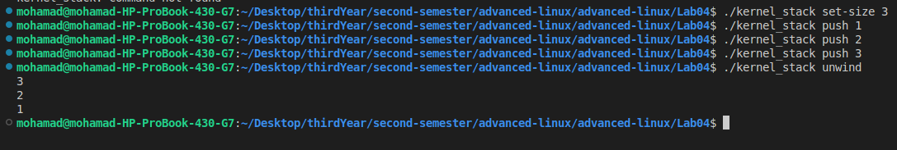
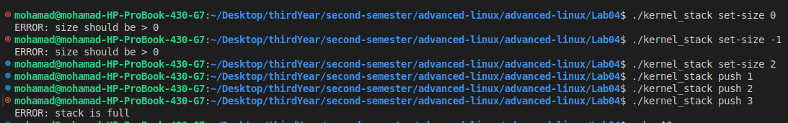
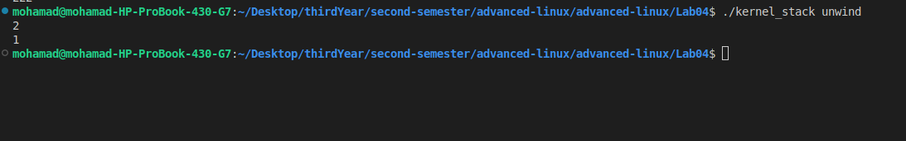

# Lab 4: Kernel Module — Integer Stack with IOCTL & Userspace Interface

**Author**: Mohamad Nour Shahin  
**Course**: Advanced Linux  
**Lab**: 4 — Kernel Modules  
**Topic**: Character Device Driver with Stack Implementation and Userspace Interface

---

## ✅ TASK, Part 1 – Kernel Module `int_stack.ko`

### 🔧 Objective Summary

In this part, I implemented a Linux kernel module `int_stack.ko` that functions as a character device driver representing a stack of integers. This device allows users to push and pop integers from the stack and supports configuring the maximum stack size using `ioctl`. The stack is dynamically allocated and protected using kernel synchronization primitives (`mutex`) to allow multithreaded access.

Key functionality includes:

- **Dynamic allocation** of stack memory
- **Mutex-based synchronization** for concurrent access (readers-writers safe)
- **Character device registration** with `open()`, `release()`, `read()`, `write()`, and `ioctl()` implementations
- **Proper error handling**:
  - Empty stack → returns `NULL`
  - Full stack → returns `-ERANGE`
  - Invalid ioctl size → returns `-EINVAL`
- **Full cleanup** on unload: memory deallocation, device node removal

---

### 🔨 Building the Kernel Module

A `Makefile` is used to compile the kernel module:

```makefile
obj-m += int_stack.o

KDIR := /lib/modules/$(shell uname -r)/build
PWD := $(shell pwd)

all:
 make -C $(KDIR) M=$(PWD) modules

clean:
 make -C $(KDIR) M=$(PWD) clean
```

To build:

```bash
make
```

To load and verify the module:

```bash
sudo insmod int_stack.ko
dmesg | tail           # Check logs
lsmod | grep int_stack # Ensure module is loaded
ls -l /dev/int_stack   # Device node should exist
sudo chmod 666 /dev/int_stack
```

---

### 📸 Screenshots

| Action | Screenshot |
|--------|------------|
| Module insertion |  |
| Device node created |  |

---

## ✅ TASK, Part 2 – Userspace CLI `kernel_stack`

### 🧾 Objective Summary

The second part of the lab required implementing a userspace program `kernel_stack` that interacts with the kernel module using file operations and `ioctl`. The utility supports the following CLI interface:

```bash
kernel_stack set-size <n>
kernel_stack push <n>
kernel_stack pop
kernel_stack unwind
```

Expected behavior:

- Set valid stack sizes with `set-size`
- Reject size `0` or negative with an error
- Reject pushing to a full stack with `-ERANGE`
- Return `NULL` on popping from an empty stack
- Print full stack on `unwind`

---

### 🔧 Compilation and Usage

To compile:

```bash
gcc kernel_stack.c -o kernel_stack
```

Example output from tests:

| Example | Screenshot |
|---------|------------|
| Build and command test |  |
| Push to full stack |  |
| Unwind full stack |  |
| Pop from empty stack |  |
| Invalid set-size tests |  |

---

[Github code](https://github.com/Mohammed-Nour/advanced-linux/tree/main/Lab04)
