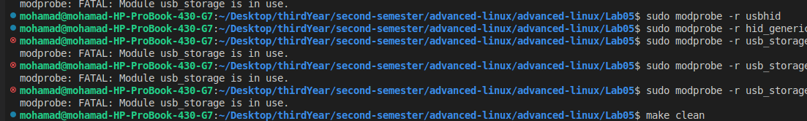
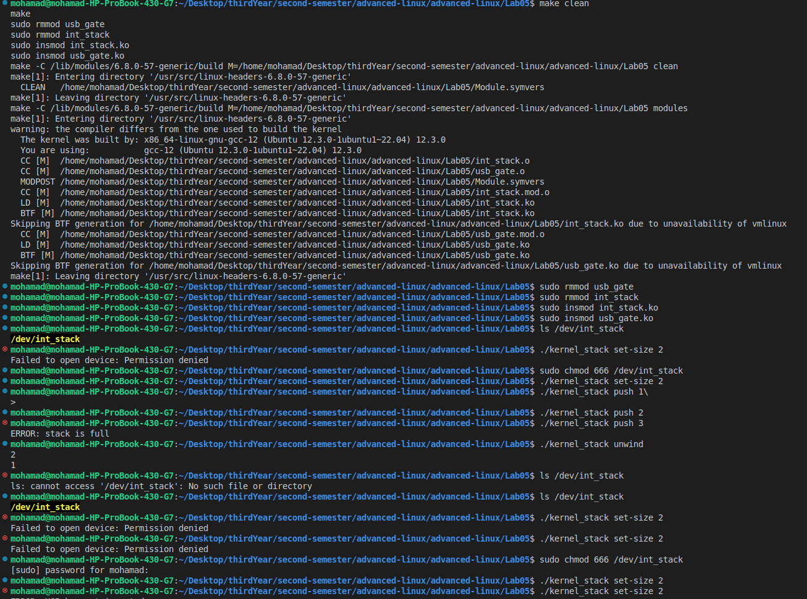

# Lab 5: USB Key Gating for Character Device

**Author**: Mohamad Nour Shahin  
**Course**: Advanced Linux  
**Lab**: 5 — USB Device Trigger  
**Topic**: Gating access to a chardev using USB detection

---

## Objective Summary

The goal of this lab is to enhance the kernel module from Lab 4 by gating access to the character device `/dev/int_stack` based on the presence of a specific USB device. The idea is to treat the USB device (keyboard, mouse, flash drive, etc.) as an "electronic key."

### Requirements

- The character device should **only appear** when the USB key is connected.
- On USB removal, the device should **disappear from `/dev`**, but the internal stack must **persist**.
- The userspace wrapper `kernel_stack` must print `ERROR: USB key not inserted` if the device is not present.
- USB matching should be based on `VID:PID`.
- Bonus points for properly handling driver conflicts (e.g., with `usb_storage`, `hid`, etc.).

---

## Implementation Overview

### 1. Modifying `int_stack.c`

The original `int_stack.c` from Lab 4 contained this line inside `int_stack_init()`:

```c
if (device_create(stack_class, NULL, dev_number, NULL, DEVICE_NAME) == NULL) {
    class_destroy(stack_class);
    cdev_del(&stack_cdev);
    unregister_chrdev_region(dev_number, 1);
    return -1;
}
```

In Lab 5, we **removed** that section:

```c
// Removed to defer device creation to USB key insertion
```

And replaced it with:

```c
pr_info("int_stack: core initialized, waiting for USB key\n");
```

This ensures the stack is initialized but **the device node is only created** by the USB gating module.

---

### 2. Creating `usb_gate.c`

We added a new file `usb_gate.c` which:

- Declares a matching `VID:PID` for a USB device (in my case, a Logitech keyboard).
- Registers a USB driver with `probe()` and `disconnect()` callbacks.
- Calls `device_create()` and `device_destroy()` for `/dev/int_stack`.

#### Example

```c
{ USB_DEVICE(0x046D, 0xC328) } // Logitech keyboard
```

To get the device information:

```bash
lsusb
```

 Screenshot:


---

### 3. Resolving Conflicts with Built-in Drivers

Initially, my USB device was being claimed by other kernel drivers (`usb_storage`, `hid_generic`, `usbhid`), so `probe()` was never triggered.

To fix this, I unloaded the conflicting drivers:

```bash
sudo modprobe -r usb_storage
sudo modprobe -r usbhid
sudo modprobe -r hid_generic
```

**Explanation**:

- These modules auto-bind to devices like flash drives, mice, and keyboards.
- By removing them temporarily, our custom USB driver (`usb_gate.ko`) is allowed to bind and trigger `probe()`.

 Screenshot:


---

### 4. Updating the Makefile

To compile both modules (`int_stack.ko` and `usb_gate.ko`), I updated the `Makefile`:

```make
obj-m += int_stack.o
obj-m += usb_gate.o

KDIR := /lib/modules/$(shell uname -r)/build
PWD := $(shell pwd)

all:
 make -C $(KDIR) M=$(PWD) modules

clean:
 make -C $(KDIR) M=$(PWD) clean
```

---

### 5. Build & Run

```bash
make clean
make

sudo rmmod usb_gate
sudo rmmod int_stack

sudo insmod int_stack.ko
sudo insmod usb_gate.ko
```

---

### 6. Test the USB Key Behavior

#### When plugged in

```bash
ls /dev/int_stack
sudo chmod 666 /dev/int_stack
```

Then test the kernel stack:

```bash
./kernel_stack set-size 3
./kernel_stack push 1
./kernel_stack push 2
./kernel_stack push 3
./kernel_stack unwind
```

---

#### When USB key is removed

```bash
ls /dev/int_stack
```

Then try:

```bash
./kernel_stack set-size 2
```

 Screenshot:


[Github Link](https://github.com/Mohammed-Nour/advanced-linux/tree/main/Lab05)

---
